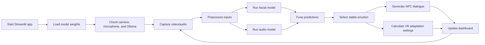

## Emotional Driven NPCs System

Emotion-aware NPC and environment adaptation system for VR-style applications. The project detects a user's emotional state from facial features and audio, combines the signals with multimodal emotion models, and maps the final emotion to NPC dialogue plus environment changes such as lighting, audio mood, and interaction behavior.

The system is built with Python, PyTorch, OpenCV, Librosa, Streamlit, and Ollama.

### Problem Statement

Traditional NPC systems often rely on fixed dialogue trees and static environment responses, which makes virtual characters feel disconnected from the player's current emotional state. This project addresses that limitation by building an emotion-aware interaction layer that detects user emotion from both facial expressions and speech signals, fuses those predictions into a stable emotion state, and uses the result to adapt NPC dialogue, behavior, lighting, and ambience in real time.

The goal is to make VR-style interactions more responsive and immersive by allowing NPCs and surrounding environments to react to how the user appears to feel, rather than only responding to scripted input or predefined game events.

### Project Novelty

The novelty of this project is the closed-loop adaptation pipeline rather than emotion classification alone. The system combines facial and speech emotion signals, stabilizes the final emotion through confidence checks and temporal smoothing, and immediately uses that emotion state to adapt NPC dialogue, behavior, lighting, and ambience.

Unlike a static NPC dialogue tree, this project creates an emotion-aware interaction layer where the detected user state drives both conversational responses and VR-style environment parameters. It also exposes explainable runtime details such as model breakdown, active modality status, contribution weights, latency, FPS, and generated dialogue, making the adaptation process observable instead of hidden behind a single prediction.

### Core Features

- Facial emotion recognition using webcam frames and a CNN model.
- Audio emotion recognition using voice features and an LSTM model.
- Multimodal fusion for combining face and audio predictions.
- Temporal smoothing to reduce noisy emotion changes.
- NPC dialogue generation through a local Ollama model, with fallback dialogue handling.
- Emotion-to-environment mapping for lighting, audio, and NPC behavior.
- Streamlit interface for running and observing the system.
- Training and evaluation scripts for custom emotion models.

### Supported Emotions

The current model configuration uses seven emotion classes:

| Emotion | System Response |
| --- | --- |
| Angry | Higher contrast, intense audio, more cautious NPC behavior |
| Disgust | Muted ambience and neutral NPC responses |
| Fear | Darker lighting, tense ambience, reassuring NPC dialogue |
| Happy | Brighter lighting, warmer ambience, friendly NPC responses |
| Neutral | Balanced environment and standard NPC behavior |
| Sad | Softer lighting, slower audio mood, supportive NPC responses |
| Surprise | Brighter transitions and curious NPC responses |

### System Flowchart



### Working Pipeline



Pipeline steps in plain terms:

1. The Streamlit app starts and loads the trained PyTorch models from `models/`.
2. Webcam frames are processed for facial emotion recognition.
3. Audio input is converted into features for speech emotion recognition.
4. Facial and audio predictions are combined into a single emotion state.
5. The recent emotion history is smoothed so the system does not react to every noisy frame.
6. The final emotion drives NPC dialogue generation and VR environment parameters.
7. The dashboard updates the detected emotion, confidence, dialogue, and system status.

### Project Structure

```text
.
├── app.py                         # Main Streamlit interface
├── main.py                        # Convenience launcher for the Streamlit app
├── config.py                      # Core configuration
├── config_unified.py              # Unified model, processing, and UI configuration
├── train_models.py                # Training pipeline for facial/audio/fusion models
├── evaluate_models.py             # Model evaluation utilities
├── vr_emotion_adaptation.py       # Main runtime adaptation logic
├── vr_components.py               # Capture, processing, and dialogue orchestration helpers
├── vr_adaptation/
│   └── environment_controller.py  # Emotion-to-environment adaptation rules
├── models/
│   ├── emotion_models.py          # CNN, LSTM, and multimodal fusion models
│   ├── advanced_fusion.py         # Attention fusion and temporal tracking helpers
│   ├── context_aware_emotion.py   # Context-aware emotion adjustment utilities
│   ├── ollama_integration.py      # Local LLM dialogue generation
│   └── *.pth                      # Saved model weights
├── data/
│   └── data_loader.py             # Facial and audio dataset loaders
├── cascades/
│   └── haarcascade_frontalface_default.xml
├── evaluation_results/            # Saved evaluation outputs
├── logs/                          # Runtime logs
└── requirements.txt               # Python dependencies
```

### Requirements

- Python 3.8 or newer
- Webcam for facial emotion detection
- Microphone for audio emotion detection
- Optional NVIDIA GPU with CUDA for faster inference/training
- Ollama for local NPC dialogue generation

For Windows, WSL2 is recommended if you need Linux-style audio/build tooling. Native Windows can also work, but packages such as `pyaudio`, `dlib`, and `face-recognition` may need extra setup.

### Installation

```bash
git clone https://github.com/ArshAli911/Emotion-Driven-NPCs.git
cd Emotion-Driven-NPCs

python -m venv venv
```

Activate the environment:

```bash
# Windows PowerShell
.\venv\Scripts\Activate.ps1

# Linux or WSL
source venv/bin/activate
```

Install Python dependencies:

```bash
pip install -r requirements.txt
pip install streamlit-autorefresh
```

If you use Linux or WSL, install the common system packages:

```bash
sudo apt update
sudo apt install -y python3-dev cmake build-essential portaudio19-dev
```

### Ollama Setup

Install Ollama, start the service, and pull a local model:

```bash
ollama serve
ollama pull deepseek-r1:latest
```

The dialogue module is configured around DeepSeek through Ollama. If Ollama is unavailable, the emotion recognition pipeline can still run, but NPC dialogue generation will be limited.

### Running the Project

Start the Streamlit dashboard:

```bash
streamlit run app.py
```

Or use the launcher:

```bash
python main.py
```

Once running, the app checks the model files, camera, microphone, and Ollama status, then displays the detected emotion, confidence, and generated NPC dialogue.

### Training Models

To train custom models:

```bash
python train_models.py
```

The training script expects facial and audio datasets to be available at the paths configured in `config.py` or `config_unified.py`. The default expected dataset layout is:

```text
archive (1)/test/
├── angry/
├── disgust/
├── fear/
├── happy/
├── neutral/
├── sad/
└── surprise/

archive/audio_speech_actors_01-24/
└── Actor_*/
    └── *.wav
```

These dataset folders are not guaranteed to be present in a fresh clone because datasets are often large and may be excluded from version control.

### Evaluating Models

```bash
python evaluate_models.py
```

Evaluation outputs are written to `evaluation_results/` when the expected datasets and model weights are available.

### Main Components

| Component | Purpose |
| --- | --- |
| `FacialEmotionCNN` | Classifies emotion from face images |
| `AudioEmotionLSTM` | Classifies emotion from audio features |
| `MultiModalEmotionFusion` | Combines facial and audio emotion signals |
| `TemporalEmotionTracker` | Smooths emotion predictions over time |
| `EnvironmentController` | Converts emotions into VR lighting, audio, and NPC settings |
| `OllamaIntegration` | Generates short NPC dialogue based on emotion and context |
| `VREmotionAdaptation` | Connects capture, inference, dialogue, and adaptation logic |

### Configuration

Common settings are stored in:

- `config.py` for model paths, dataset paths, processing settings, VR settings, and Ollama settings.
- `config_unified.py` for a stricter dataclass-based configuration structure.
- `vr_adaptation/environment_controller.py` for emotion-specific lighting, audio, and NPC behavior values.

### Known Limitations

- Real-time quality depends on webcam, microphone, CPU/GPU speed, and model size.
- Dataset folders may need to be added manually before training or evaluation.
- Ollama dialogue requires a local Ollama service and a downloaded model.
- The project exposes VR adaptation parameters, but direct Unity/Unreal plugin integration is not included in this repository.
- Some audio and face-recognition dependencies may require platform-specific installation steps.

### Future Improvements

- Add a formal test suite for capture, model loading, and dialogue fallback behavior.
- Add screenshots or a short demo GIF of the Streamlit dashboard.
- Package dataset path configuration into a single `.env` or YAML file.
- Add a Unity or Unreal bridge that consumes the generated adaptation parameters.
- Improve dependency pinning for reproducible installs.

### License

Add a license file before public release if this project is intended for open-source distribution.
